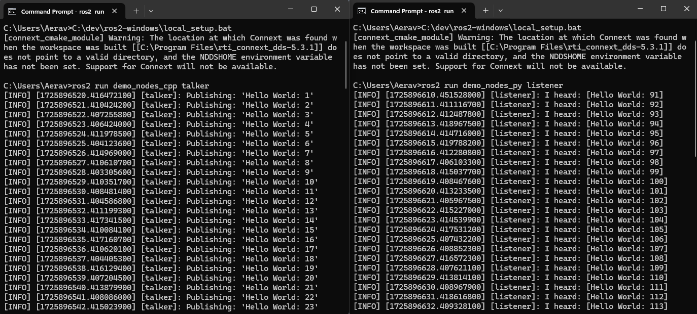

# Advanced Steps

1. Download the windows-ros2.zip from https://drive.google.com/drive/folders/1ccL3-VYHPmKJODokbvOHA6Drp1vD3YpY?usp=sharing

2. Run ***Windows PowerShell*** as administrator

3. Install Chocolatey
    ```
    Set-ExecutionPolicy Bypass -Scope Process -Force; [System.Net.ServicePointManager]::SecurityProtocol=[System.Net.ServicePointManager]::SecurityProtocol -bor 3072; iex ((New-Object System.Net.WebClient).DownloadString('https://community.chocolatey.org/install.ps1'));
    ```
4. Close and reopen ***PowerShell***, making sure to run it as administrator before continuing
5. In the new ***PowerShell***, navigate to the folder that the .zip was downloaded to. e.g. `cd C:\Users\YOUR-USERNAME\Downloads`

6. Extract the downloaded .zip (and inner .zip folders) with the following commands:
    ```
    Expand-Archive -LiteralPath .\windows-ros2.zip -DestinationPath .; Expand-Archive -LiteralPath .\windows-ros2\opencv-3.4.6-vc16.VS2019.zip -DestinationPath 'C:\Program Files\'; Expand-Archive -LiteralPath .\windows-ros2\ros2-foxy-20230620-windows-release-amd64.zip -DestinationPath 'C:\dev\';
    ```
    > This extracts the downloaded .zip and then the ***OpenCV*** and **ros2_foxy** folders into the appropriate places

7. Install ***Python***, ***OpenSSL***, Visual C++ Redistributables, CMake, Chocolatey Git Packages
    ```
    choco install -y python --version=3.8.3; choco install -y openssl --version=1.1.1.3; choco install -y vcredist2013 vcredist140; choco install -y cmake; choco install -y graphviz; choco install -y -s .\windows-ros2 asio cunit eigen tinyxml-usestl tinyxml2 log4cxx bullet;      
    ```
    > It is fine to ignore any error messages about packages already being installed.

8. Set ***OpenSSL*** and ***OpenCV*** environment variables
    ```
    setx /m OPENSSL_CONF "C:\Program Files\OpenSSL-Win64\bin\openssl.cfg"; setx /m OpenCV_DIR "C:\Program Files\opencv";
    ```

9.  Update environment settings using ***Chocolatey*** helper script

    ```
    Set-ExecutionPolicy Bypass -Scope Process -Force; Import-Module C:\ProgramData\chocolatey\helpers\chocolateyInstaller.psm1; refreshenv;
    ```

10. Install Python Command Line Tools, RQt Dependencies
    ```
    python -m pip install --upgrade pip; python -m pip install -U catkin_pkg cryptography empy ifcfg lark-parser lxml netifaces numpy opencv-python pyparsing pyyaml setuptools rosdistro pydot PyQt5
    ```
11. Run the ***Visual Studio Community*** installer
    ```
    .\windows-ros2\VisualStudioSetup.exe
    ```
- In the ***Visual Studio Community*** installer:
    - In the left pane, make sure **Desktop development with C++** is ticked.
    - Untick **C++ Clang tools for windows** and **C++ Cmake Tools for windows** in the **Installation details** pane and click *Modify*.
    - 
## 8: Add Environment Variables to PATH

1. Search for `Environment variables` in the start menu and open **Edit the system environment variables**
2. Click **Environment Variables** button 
3. In the bottom pane called **System variables**, select **Path** and click on **Edit** button
4. Click on **New** button and add the following paths (one at a time):
    - `C:\Program Files\OpenSSL-Win64\bin\`
    - `C:\Program Files\opencv\x64\vc16\bin`
    - `C:\Program Files\CMake\bin`
    - `C:\Program Files\Graphviz\bin`

<div style="page-break-after: always;"></div>

## Test ROS2 Foxy Install
1. Open two ***Command Prompt*** windows
2. Run the following in both:
    ```
    C:\dev\ros2_foxy\local_setup.bat
    ```
    > It is normal that the previous command, if nothing else went wrong, outputs “The system cannot find the path specified.” exactly once.
    >
    > A [connext_cmake_module] warning might also occur. This has no impact on the installation and can be ignored unless specific support for Connext is required

3. In one of the two terminals, run:
    ```
    ros2 run demo_nodes_cpp talker
    ```
    In the other terminal, run:
    ```
    ros2 run demo_nodes_py listener
    ```
4. If the two programs are running then ROS is installed properly. 
    
