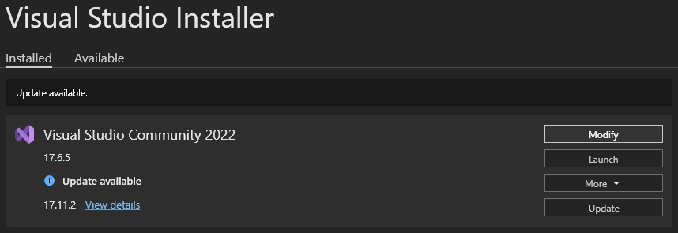
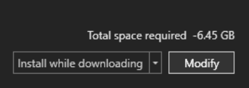
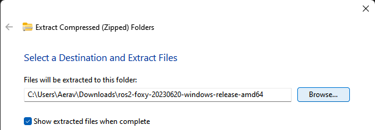
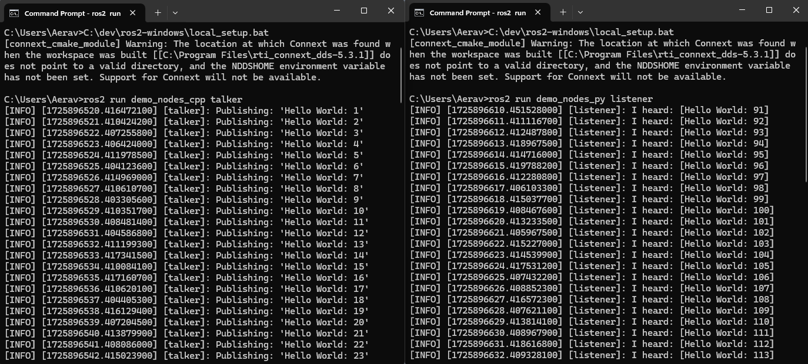

# Installing ROS2 Foxy on Windows

> Windows 10 is required as a minimum as ROS only officially supports Windows 10. This guide was made while installing it on Windows 11.
> 
> Windows PowerShell v2+ minimum 
>
>**OpenSSL**
>
> The ROS for Windows installation page lists ***OpenSSL*** **v1.1.1n** as a requirement to be installed. The page it suggests to download the installer from does not have this installer. It may have been removed due to security vulerabilities.
>
> An appropriate ***OpenSSL*** version can still be downloaded using ***Chocolatey***. This is just some information if you are trying to follow along with the official ROS instructions. For this, we will be installing ***OpenSSL*** **v1.1.1.3**
> 
> Win32 or Light versions, or the v3.X.Y installers are not compatible with ROS so we must use a version of 1.1.1.
>
> **Chocolatey installation script**
>
> The installation script that is written below in this guide comes from the ***Chocolatey*** website at https://chocolatey.org/install.
> - The required installation is under the **individual** installation option
> 
> - It's a good idea to check installation scripts are valid and from a verifiable source so I've included this link so you can check the validity of the installation script.

---

## Step 1: Install Chocolatey

***Chocolatey*** is a package manager for Windows and will be used throughout this guide to install all dependencies and packages for ROS.

1. Open Start menu search / press Windows key and  type:
    ```
    Windows Powershell
    ```
2. Right click ***Windows PowerShell*** and select *Run as Administrator*

    
    
3. Click *Yes* to the prompt

    

4. Execute the ***Chocolatey*** installation script by running the following command in the ***PowerShell*** terminal:
    ```
    Set-ExecutionPolicy Bypass -Scope Process -Force; [System.Net.ServicePointManager]::SecurityProtocol = [System.Net.ServicePointManager]::SecurityProtocol -bor 3072; iex ((New-Object System.Net.WebClient).DownloadString('https://community.chocolatey.org/install.ps1'))
    ```
    

    

5. If you don't see any errors, you are ready to use ***Chocolatey***! 
Type `choco` to check that it has been installed.

    

1. Close and reopen ***PowerShell***, making sure to *Run as administrator*.

    

---

## Step 2: Install Python
> The specific version of ***Python*** required is 3.8.3.

1. In the ***PowerShell*** terminal, run the following:
    ```
	choco install -y python --version=3.8.3
    ```
    

---

## Step 3: Install Visual C++ Distributables
1. In the ***PowerShell*** terminal, run the following:
    ```
    choco install -y vcredist2013 vcredist140
    ```

    

    > The previous ***Python*** installation may have already installed one or more of these packages, which will cause the following message:

    
    
    > This is fine to ignore; There is no need to reinstall any packages you already have.

---

## Step 4: Install OpenSSL

1. In the ***PowerShell*** terminal, run the following:
    ```
    choco install openssl --version=1.1.1.3
    ```

2. Type `Y` when prompted and press Enter
    
    

    > It should say **Installing 64-bit openssl** after you press Enter
3. Type the following command into the ***PowerShell*** terminal and press Enter:
    ```
    setx /m OPENSSL_CONF "C:\Program Files\OpenSSL-Win64\bin\openssl.cfg"
    ```
    
    > This sets an enviroment variable that will persist across different sessions.

---

## Step 5: Install Visual Studio
> **[ ! ] IMPORTANT**<br>
> This is an installation of ***Visual Studio***, not ***Visual Studio Code***.
>
> Microsoft didn't do a thorough think before naming these two programs the way they did.
>
> ***Visual Studio*** has both a paid version and a free version. This install is for the free version.
>
> The free version is called ***Community***.

1. Go to https://visualstudio.microsoft.com/free-developer-offers/ and download ***Community***

    
2. Navigate to where the installer downloaded to and run it once it has finished downloading

    
    
    Just click *Close* if prompted to update
    

3. Click on *Modify* in the Visual Studio Community section (above *Launch*)
    


4. In the *Modify* window, scroll down to **Desktop development with C++** and make sure the checkbox is ticked.
    

5. In the **Installation details** menu to the right, untick **C++ Clang tools for windows** and **C++ Cmake Tools for windows**

    
    


    Then click *Modify*

    
6. Allow installer to finish the installation
    

---

## Step 6: Install OpenCV
> ***OpenCV*** is a package that is used for computer vision and image processing. This is not an essential installation but some examples provided by ROS Foxy use ***OpenCV*** and require it to be installed.

1. You can download a precompiled version of ***OpenCV*** **3.4.6** from:
    ```
    https://github.com/ros2/ros2/releases/download/opencv-archives/opencv-3.4.6-vc16.VS2019.zip
    ```
    **Note: This is a .zip link and will automatically download the folder if pasted into the browser**

2. Extract the .zip to **Program Files** by right-clicking the .zip and clicking on *Extract All...*

    

- Click *Browse* to change the extraction path
    
    > You can uncheck **Show extracted files when complete** if you want.

- Navigate to **C:\\** and click on **Program Files** to select it and click *Select Folder* down the bottom right
    

- Alternatively, you can just directly type the file path into the text box
    

    
- Click *Extract* to extract the files

- Click *Continue* to allow files to be extracted to **Program Files**
    

3. Assuming you unpacked it to **C:\Program Files\opencv**

    Type the following command into the ***PowerShell*** terminal and press enter:
    ```
    setx /m OpenCV_DIR "C:\Program Files\opencv"
    ```
    > This is setting an environment variable for ***OpenCV*** so it knows where to find the ***OpenCV*** files

    

---

## Step 7: Install Dependencies (CMake and Git Packages)

### Install CMake 
1. Type the following command into the ***PowerShell*** terminal and press enter:
    ```
    choco install -y cmake
    ```

    

### Download Git packages
1. Go to https://github.com/ros2/choco-packages/releases/latest

    

2. Download all except **log4cxx.0.10.0-2.nupkg** and the **source code** folders:
    - asio.1.12.1.nupkg
	- bullet.2.89.0.nupkg
	- cunit.2.1.3.nupkg
	- eigen-3.3.4.nupkg
	- tinyxml-usestl.2.6.2.nupkg
	- tinyxml2.6.0.0.nupkg
	- log4cxx.0.10.0.nupkg

3. In the ***PowerShell*** terminal, copy and paste the following command but **do not press enter yet**:
    ```
    choco install -y -s <PATH\TO\DOWNLOADS> asio cunit eigen tinyxml-usestl tinyxml2 log4cxx bullet
    ```

4. Navigate to the folder that the packages were downloaded to so that you can click on the folder itself.
  - Right-click the folder and select *Copy as path* (or Ctrl + Shift + C)
    > e.g. The files were downloaded into the **Downloads** folder, so I copy the path of the **Downloads** folder

    

- Replace `<PATH\TO\DOWNLOADS>` with the copied filepath

    

    

1. Press Enter to install the packages

    

2. Close and reopen ***PowerShell*** again, making sure to *Run as administrator*.

    

### Python Command Line Tools
1. Run the following command into the ***PowerShell*** Terminal and press Enter to upgrade pip
    ```
    python -m pip install --upgrade pip
    ```
2. Run the following command into the ***PowerShell*** terminal and press Enter
    ```
    python -m pip install -U catkin_pkg cryptography empy ifcfg lark-parser lxml netifaces numpy opencv-python pyparsing pyyaml setuptools rosdistro
    ```

    

    > **[ ! ] Important** <br>
    > If you encounter the following error, your version of pip needs to be upgraded

    

    Type the following command into the ***PowerShell*** Terminal and press Enter to upgrade pip 
    ```
    python -m pip install --upgrade pip
    ```
    - Once pip is upgraded, try executing the command at step 2 again

### RQt Dependencies
1. Paste the following command into the ***PowerShell*** terminal and press enter
    ```
    python -m pip install -U pydot PyQt5
    ```

    

2. Use ***Chocolatey*** to install ***Graphviz*** (required to use RQt Graph)
- Paste the following command into the ***PowerShell*** terminal and press Enter
    ```
    choco install graphviz
    ```
- Type `Y` and press enter when prompted

    

---

## Step 8: Adding Variables to PATH
1. Click on Start button / press Windows key and search for:
	```
	Environment Variables
	```

	

2. Open **Edit the system environment variables**
3. In the **System Properties** window that pops up, click on *Environment Variables*

	


4. In the bottom panel called **System Variables**, click on **Path** and then click on *Edit*
	

5. In the **Edit environment variable** window that pops up, click on the *New* button.

	

6. Create a *New* path for each of the following paths:
- C:\Program Files\OpenSSL-Win64\bin\
- C:\Program Files\opencv\x64\vc16\bin
- C:\Program Files\CMake\bin
- C:\Program Files\Graphviz\bin

1. From completing all of the installation steps up until now, these are the environment variables should be set.

	
	
	> Make sure to add any if they are missing. The paths should be the same as in the picture if you installed everything in the default locations in the instructions.

---

## Step 10: Install ROS2 Foxy
1. Go to https://github.com/ros2/ros2/releases and find the latest release of ROS2 Foxy
    > Currently it is at https://github.com/ros2/ros2/releases?page=2 

    

2. Download the latest package for Windows, e.g., ros2-foxy-*-windows-AMD64.zip
- Right click the downloaded .zip and select *Extract All...*

    

- Click *Browse* to change the extraction path

    

- Create new folder in **C:\\** called **dev**

    

- Select **dev** and click on *Select Folder* down the bottom right 

    

- Click on *Extract* to extract the files. Allow permission to continue if prompted.

    

3. The extracted folder has the name **ros2-windows** but the ROS2 Foxy tutorials assume it is called **ros2_foxy**. 
    - You can either keep it as **ros2-windows**, but remember to substitute **ros2-windows** where ever the tutorials mention **ros2_foxy**, or rename the folder.

- To rename the folder, right click on the folder and select *Show more options*

    

- Click on Rename

    

- Change the name to **ros2_foxy**

    

4. Set up ROS environment
- Open Start menu search / press Windows key and  type:
    ```
    cmd
    ```

    

- Open ***Command Prompt***, paste the following command in the terminal window and press Enter
    ```
    C:\dev\ros2_foxy\local_setup.bat
    ```
    > This assumes the ROS2 package was extracted to **C:\dev** and was renamed to **ros2_foxy**. Change this path to where ever your ROS package was extracted to.
    
    > This command needs to be run every time a new Command Prompt terminal is opened.

    

    > It is normal that the previous command, if nothing else went wrong, outputs “The system cannot find the path specified.” exactly once.

    

    > When running the local_setup.bat, this error might occur. It has no impact on the installation and can be ignored unless specific support for Connext is needed.

5. Test Installation
- Open a second Command Prompt window and execute the same command as before in the new window
    ```
    C:\dev\ros2_foxy\local_setup.bat
    ```
- Make sure that any new terminal windows are **Command Prompt** and not **PowerShell**. You can choose the terminal type with the small arrow next to the tab.

    

- In one of the two terminal windows, paste the following command and press Enter
    ```
    ros2 run demo_nodes_cpp talker
    ```
- In the other terminal window, paste the following command and press Enter
    ```
    ros2 run demo_nodes_py listener
    ```
- Give permission for the executable to run if prompted
- If the two programs are running then ROS is installed. 

    

### Troubleshooting
https://docs.ros.org/en/foxy/How-To-Guides/Installation-Troubleshooting.html#windows-troubleshooting