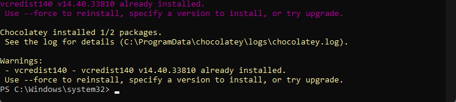

# Simple Steps
## 1: Install Chocolatey

1. Run ***Windows PowerShell*** as administrator

2. In the ***PowerShell*** terminal, run the following:
    ```
    Set-ExecutionPolicy Bypass -Scope Process -Force; [System.Net.ServicePointManager]::SecurityProtocol = [System.Net.ServicePointManager]::SecurityProtocol -bor 3072; iex ((New-Object System.Net.WebClient).DownloadString('https://community.chocolatey.org/install.ps1'))
    ```

3. If you don't see any errors, you are ready to use ***Chocolatey***! 

4. Close and reopen ***PowerShell***, making sure to *Run as administrator*.

## 2: Install Python
In the ***PowerShell*** terminal, run the following:
```
choco install -y python --version=3.8.3
```

## 3: Install Visual C++ Redistributables
In the ***PowerShell*** terminal, run the following:
```
choco install -y vcredist2013 vcredist140
```

> The previous ***Python*** installation may have already installed one or more of these packages, which will cause the following message:



> This is fine to ignore; There is no need to reinstall any packages you already have

## 4: Install OpenSSL
1. In the ***PowerShell*** terminal, run the following:
    ```
    choco install openssl --version=1.1.1.3
    ```
    > It should say ***Installing 64-bit openssl*** when installing.

2. Type the following command into the ***PowerShell*** terminal and press Enter:
    ```
    setx /m OPENSSL_CONF "C:\Program Files\OpenSSL-Win64\bin\openssl.cfg"
    ```

## 5: Install Visual Studio
> **[ ! ] IMPORTANT**<br>
> This is an installation of ***Visual Studio***, not ***Visual Studio Code***.
>
> ***Visual Studio*** has both a paid version and a free version. This install is for the free version.
>
> The free version is called ***Community***.

1. Go to https://visualstudio.microsoft.com/free-developer-offers/ and download ***Community***
2. Run the installer and click *Modify* under the **Installed** tab.
3. In the left pane, check that **Desktop development with C++** is ticked.
4. Untick **C++ Clang tools for windows** and **C++ Cmake Tools for windows** in the **Installation details** pane and click *Modify*.

## Step 6: Install OpenCV
1. Download a precompiled version of OpenCV 3.4.6 from:
    ```
    https://github.com/ros2/ros2/releases/download/opencv-archives/opencv-3.4.6-vc16.VS2019.zip
    ```
    **Note: This is a .zip link and will automatically download the folder**

2. Extract the .zip to **Program Files** by Right-Clicking the .zip and clicking on *Extract All...* and changing the destination path to `C:\Program Files`
3. Run the following command into the ***PowerShell*** terminal:
    ```
    setx /m OpenCV_DIR "C:\Program Files\opencv"
    ```

<div style="page-break-after: always;"></div>

## 7: Install Dependencies

Close and reopen ***PowerShell*** again, making sure to *Run as administrator*.

### CMake
1. Run the following command into the ***PowerShell*** terminal:
    ```
    choco install -y cmake
    ```

### Chocolatey Git Packages
1. Go to https://github.com/ros2/choco-packages/releases/latest

2. Download:
    - asio.1.12.1.nupkg
	- bullet.2.89.0.nupkg
	- cunit.2.1.3.nupkg
	- eigen-3.3.4.nupkg
	- tinyxml-usestl.2.6.2.nupkg
	- tinyxml2.6.0.0.nupkg
	- log4cxx.0.10.0.nupkg

    > Note: <br>
    > Download all except **log4cxx.0.10.0-2.nupkg** and the **source code** folders

3. In the ***PowerShell*** terminal, copy and paste the following command and change `<PATH\TO\DOWNLOADS>` with the path of the folder that the packages were downloaded to:
    ```
    choco install -y -s <PATH\TO\DOWNLOADS> asio cunit eigen tinyxml-usestl tinyxml2 log4cxx bullet
    ```

### Python Command Line Tools
Run the following command in the ***PowerShell*** Terminal to upgrade pip and install the tools
```
python -m pip install --upgrade pip; python -m pip install -U catkin_pkg cryptography empy ifcfg lark-parser lxml netifaces numpy opencv-python pyparsing pyyaml setuptools rosdistro
```
<div style="page-break-after: always;"></div>

### RQt Dependencies
1. Paste the following command into the ***PowerShell*** terminal and press enter
    ```
    python -m pip install -U pydot PyQt5
    ```
2. Use Chocolatey to install Graphviz (required to use RQt Graph)
- Paste the following command into the ***PowerShell*** terminal and press Enter
    ```
    choco install graphviz
    ```

## 8: Add Environment Variables to PATH

1. Search for `Environment variables` in the start menu and open **Edit the system environment variables**
2. Click **Environment Variables** button 
3. In the bottom pane called **System variables**, select **Path** and click on **Edit** button
4. Click on **New** button and add the following paths (one at a time):
    - C:\Program Files\OpenSSL-Win64\bin\
    - C:\Program Files\opencv\x64\vc16\bin
    - C:\Program Files\CMake\bin
    - C:\Program Files\Graphviz\bin 

## 9: Install ROS2 Foxy
1. Go to https://github.com/ros2/ros2/releases?page=2 and download the latest package for Windows, e.g., ros2-foxy-*-windows-AMD64.zip
2. Create a new folder in **C:\\** called **dev** and extract the downloaded .zip into **C:\\dev**
3. Change the name of the extracted folder from **ros2-windows** to **ros2_foxy**

<div style="page-break-after: always;"></div>

## Test ROS2 Foxy Install
1. Open two ***Command Prompt*** windows
2. Run the following in both:
    ```
    C:\dev\ros2_foxy\local_setup.bat
    ```
    > It is normal that the previous command, if nothing else went wrong, outputs “The system cannot find the path specified.” exactly once.
    >
    > A [connext_cmake_module] warning might also occur. This has no impact on the installation and can be ignored unless specific support for Connext is required

3. In one of the two terminals, run:
    ```
    ros2 run demo_nodes_cpp talker
    ```
    In the other terminal, run:
    ```
    ros2 run demo_nodes_py listener
    ```
4. If the two programs are running then ROS is installed properly. 
    